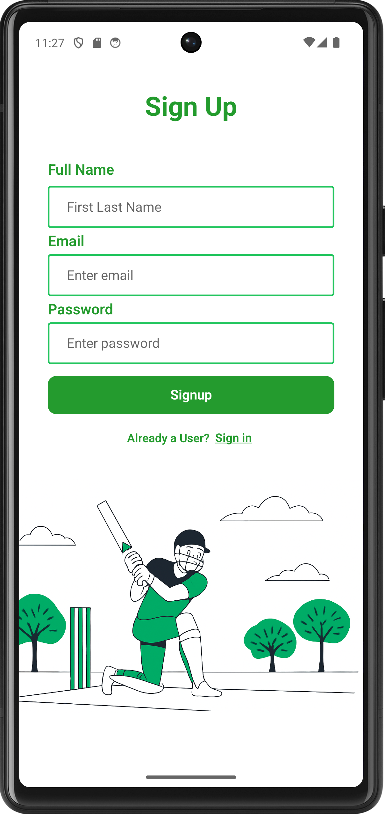
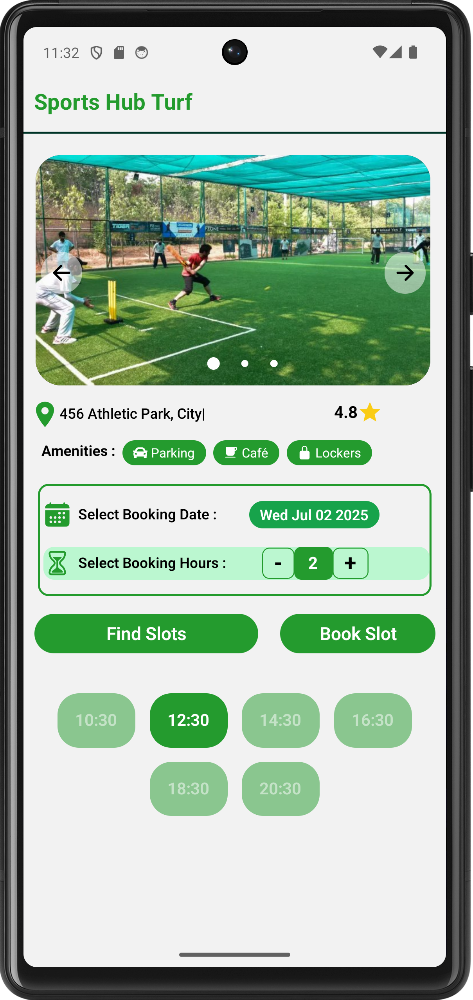
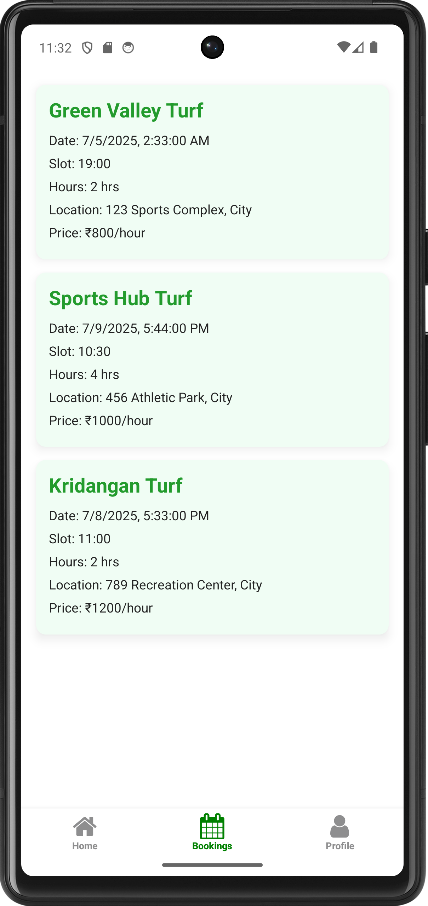

# TeamUP-Turf Booking App 

> One-stop solution for discovering, booking, and managing turf slots seamlessly.  
> Built using **React Native** + **Firebase**, styled with **NativeWind**.

---
## 🔗 Figma Design

Explore the handcrafted UI/UX design on Figma:
🎨 [Figma Preview (TeamUP)](https://n9.cl/twtxnz)

---
## 📱 Features

- 🔐 **User Authentication** (Sign up / Sign in / Guest login)
- 🗓️ **Date & Hour Slot Picker** for seamless booking
- 🖼️ **Dynamic Image Carousel** from Firebase
- 🎯 **Real-time Turf Availability**
- 💸 **Price and Location-Based Booking**
- 🧰 **Amenity Display** with rich icons
- 🔄 **Live Updates** via Firebase Realtime Queries
- 🧪 Designed with **Component-Based Architecture**

---
## 🚀 Tech Stack

| Technology     | Description                     |
|----------------|---------------------------------|
| React Native   | Cross-platform app development  |
| Firebase       | Auth, Firestore DB, Storage     |
| NativeWind     | Tailwind CSS for React Native   |
| Expo           | Fast development + deployment   |

---
## 📸 Screenshots

| Authentication | Home | Slot Booking | Bookings |
|----------------|------|--------------|----------|
|  |  |  |  |
---
## 🛠 Installation & Setup

**Navigate into the project directory**
*cd TeamUP-App*

**Install all required dependencies**
*npm install*

**Start the development server**
*npx expo start*
---
## 🌟 Credits

- 🔧 *Designed & Developed* by **[Akshay Kale]**
- 🎨*UI/UX Design* handcrafted in *[Figma](https://n9.cl/twtxnz)*
- 📲 *Built From Scratch* using:
  - *React Native* (Frontend)
  - *Firebase* (Authentication, Firestore, Storage)
  - *NativeWind* (Tailwind for React Native)
  - *Expo* (Development & APK Build)
---
⭐ Star this repo if you like the project!
💬 Feel free to contribute or raise an issue.
